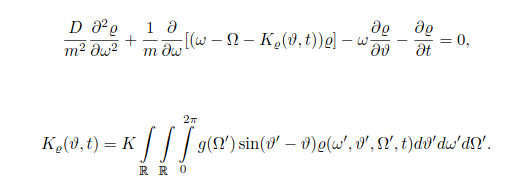
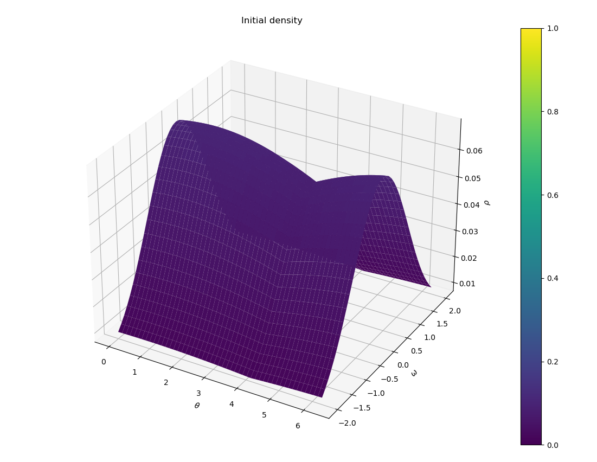
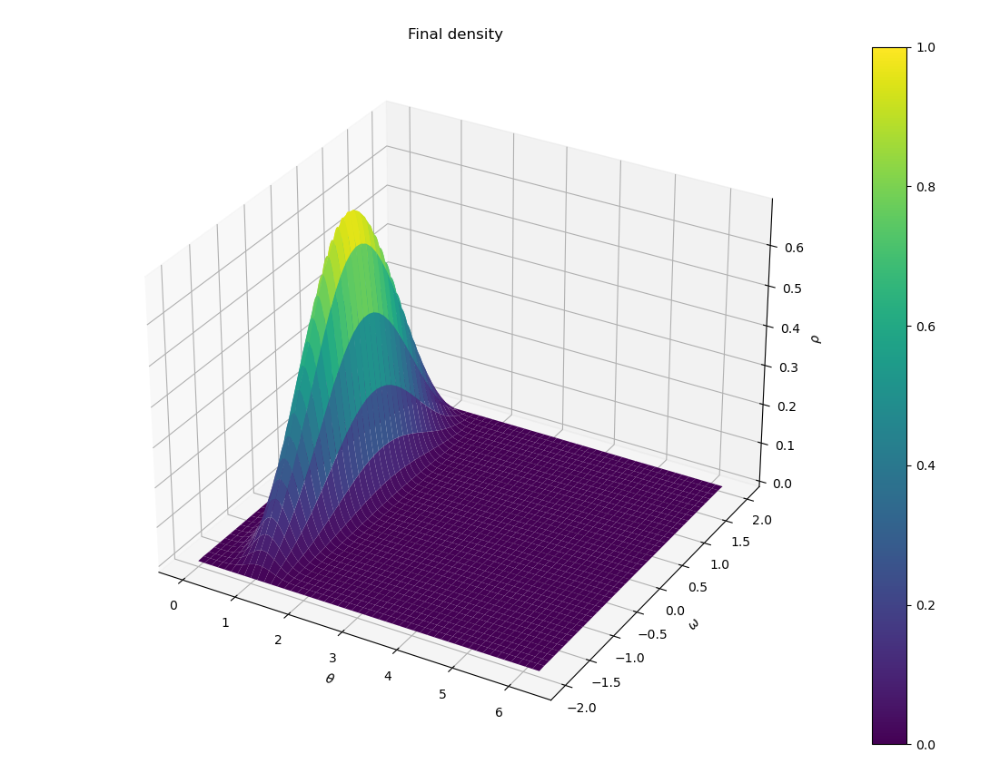

# First-order Kuramoto Model Simulator

This project is a numerical simulator for the second order mean field Kuramoto PDE 

<p align="center">
  
</p>

## Model

The equation describes the evolution of the density function, with:

- ρ : density function
- θ : phase variable
- ω : frequency variable
- t : time variable
- m : mass variable
- D : noise coefficient
- Ω : natural frequency  
- g(Ω) : natural frequency distribution
- K : coupling strength  

For more details about this Kuramoto model see [https://www.sciencedirect.com/science/article/pii/S0022247X24007595].

##  Description

The simulator allows the user to:
- compute numerical simulations of the Kuramoto dynamics
- compute phase synchronization dependence on the parameters (to be implemented)
- save simulation results for post processing and visualization
- data visualization of the results

## Numerical simulation

The user can specify a configuration (final time, noise level, mass, coupling constant, 
initial condition, natural frequency distribution), and simulate the evolution of the density.

<table>
  <tr>
    <td align="center">
      
    </td>
    <td style="width:80px;"></td>
    <td align="center">
      
    </td>
  </tr>
</table>

Warning: the numerical scheme is an explicit finite difference method. In order to have a stable method, the time discretization scales as the square of the frequencty discretization, and depends on the parameters K, m, D, as well as on the grid. We suggest to read Section 4 in [https://www.sciencedirect.com/science/article/pii/S0022247X24007595] for more details.


##  How to build and run

###  Requirements

- C++ compiler (e.g. `g++`, `clang++`, MSVC)
- CMake (>= 3.10)
- Python >= 3.8 with numpy and matplotlib

---

###  Build

Clone the repository:

```bash
git clone https://github.com/giulioPecorella98/Second-order-Kuramoto.git
```

Set building directories:

```bash
cd Second-order-Kuramoto
mkdir build
cd build
```

On Linux systems:
```bash
cmake ..
cmake --build .
```

On Windows, you need to specify a generator (e.g. MinGW):

```bash
cmake -G "MinGW Makefiles" ..
cmake --build .
```


Run the python script main.py.


---


## Notes

This is a numerical implementation for research/educational purposes. 
